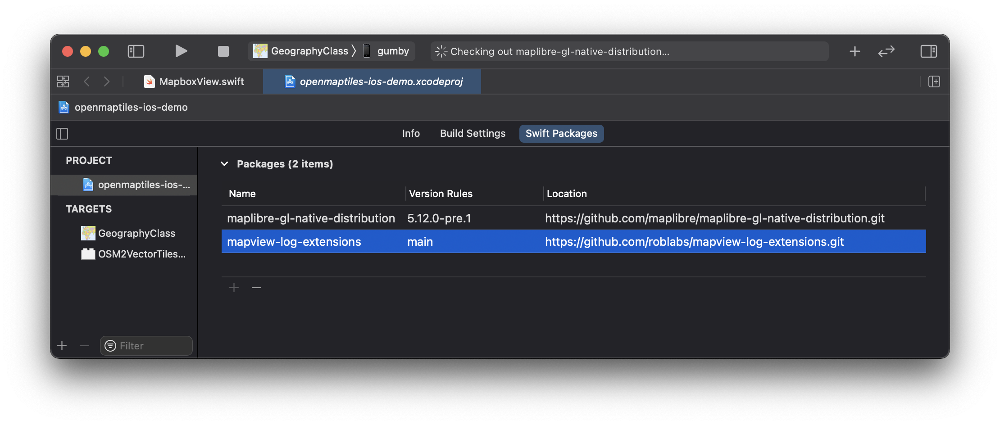
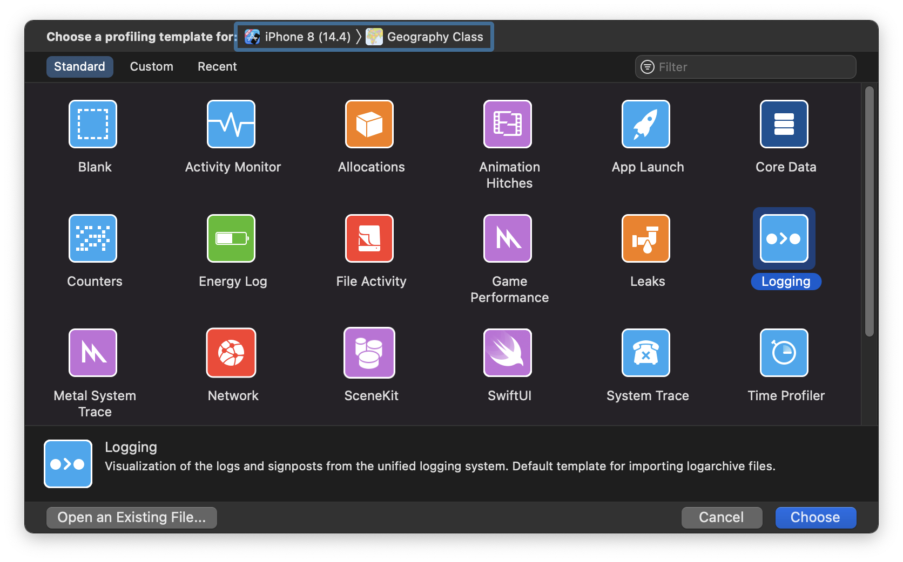

# ``MapViewOSLogExtensions``

Opinionated Swift logging of map view events for [MapKit](https://developer.apple.com/documentation/mapkit/mkmapviewdelegate), [Mapbox](https://docs.mapbox.com/ios/maps/api/6.3.0/Protocols/MGLMapViewDelegate.html) & [MapLibre](https://github.com/maplibre/maplibre-gl-native/blob/master/platform/ios/platform/macos/src/MGLMapViewDelegate.h).  Plays well with Xcode Instruments for millisecond timing of events.

## Overview

Measure map view events such as `DidFinishLoadingStyle`, `DidFinishRenderingMap`, & `DidBecomeIdle` using `OSLog` and `os.signpost`.

## Topics

### How to Use

#### 1.  Add the package via the Swift Package Manager.




#### 2.  Add Opinionated Logs for map view.

See the enumeration ``mapEvents`` for suggested strings for your logs.

```swift
import OSLog
import MapViewOSLogExtensions

func beginMeasurementInterval() {
  // Construct the map view object
  OSLog.mapView(.begin, "measure some event")
}

func setZoomLevel(_ zoomLevel: Double) {
    // Logs to Xcode console & Xcode Instruments
    OSLog.mapView(.event, "zoomLevel: \(zoomLevel)")
    mapView.zoomLevel = zoomLevel
}

func endMeasurementInterval() {
  // This could be in an event handlers
  OSLog.mapView(.end, "measure some event")
}
```

---

### Xcode Instruments

Use Xcode Instruments for filtering logs and measuring event intervals.  For more information on Xcode Instruments & signposts, see [Measuring Performance Using Logging](https://developer.apple.com/videos/play/wwdc2018/405/) from WWDC 2018.

*Xcode Instruments with the Logging template selected.*



---

*Logging template with `os_log` and set input filter by a string.*
> Making observations on the data, the first entry is for 381 milliseconds, and the first entry for `DidBecomeIdle` is at 1258 milliseconds.


---

*Logging template with `os_signpost` and input filter set to filter by the name of the subsystem.*
> This view of the `os_signpost` shows that the first entry is for `DidBecomeIdle` is at 1258 milliseconds.  The event `WillStartLoadingMap` started at 401 milliseconds, or about 850 milliseconds.  There is also a second `DidBecomeIdle` event occuring several seconds later.

